# servlet

### 1:http协议

a1:Http请求分为三部分：请求行（第一行）、请求头（键值对）、请求体（From Data，Post请求才有）

a2:Http响应分为三部分：响应行（第一行）、响应头（键值对）、响应体（From Data，Post请求才有）

### 2:Tomcat和Servlet工作流程


### 3:Request对象的常用方法


#### 3.1:获取请求参数：


#### 3.2:Tomcat乱码设置

VMoptions:  -Dfile.encoding=UTF-8


### 4：请求转发(服务器行为，做跳转)


### 4.1：请求转发


### 6：Request作用域/Request域对象


请求转发到jsp文件，jsp文件接受参数


### 7：Response对象（响应数据）

#### 7.1下面这两种流不能同时使用


#### 7.2响应乱码问题

（服务端和客户端都有编码格式，都需要改）

```
       //分别设置服务端和客户端的编码
        resp.setCharacterEncoding("UTF-8");
        // text/html设置了html格式，可以正常显示h2标签
        resp.setHeader("content-type", "text/html;charset=UTF-8");
        //同时设置服务端和客户端的编码
        resp.setContentType("text/html;charset=UTF-8");

```


### 7.3：重定向

特点：

1.服务端指导，客户端行为（地址栏变化，客户重新访问）

2.存在两次请求

3.地址栏发生改变

4.重定向状态码302

5.request域中数据不共享

#### 

### 7.4请求转发和重定向区别


### 8.Cookie对象


#### 8.1Cookie的创建和发送


#### 8.2获取Cookie


#### 8.3Cookie设置过期时间


代码：


#### 8.4Cookie注意点


#### 8.5Cookie的路径


### 9.Session对象


#### 9.0Session常用方法

request.getSession（）方法获取Session对象，没有则创建对象。


#### 9.1 标识符JSESSIONID

session底层依赖cookie，存在cookie里面，关闭浏览器则失效。
客户端存有session，但是服务端重启后，服务端里查不到对应id，则会重建session，再传给客户端。


#### 9.2 Session域对象


#### 9.3 Session对象销毁


### 10.ServletContext对象


#### 10.1.ServletContext对象的获取

获取以及常用方法


#### 10.2.ServletContext域对象


### 11.文件上传和下载


#### 11.1.2后台实现


#### 11.2文件下载


#### 11.2.2后台下载


# jsp学习

### 1.基础语法


### 2.scriptlet （在jsp中写java代码，不建议这样写）

!


### 4.include包含

#### 4.1 静态包含


静态包含特点：


#### 4.2动态包含特点：


#### 4.3不传递参数是include标签中不能有空格，下面是传递参数的写法


### 5.jsp四大域对象


### 5.1服务端跳转和客户端跳转的区别


### 2.4EL表达式

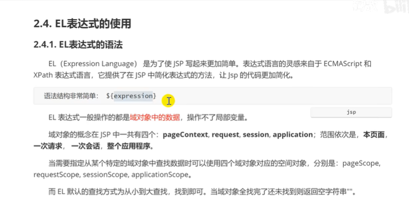

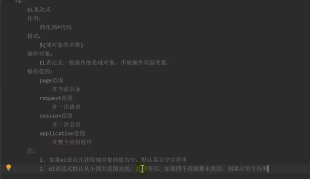

局部变量是拿不到的，优先取小的

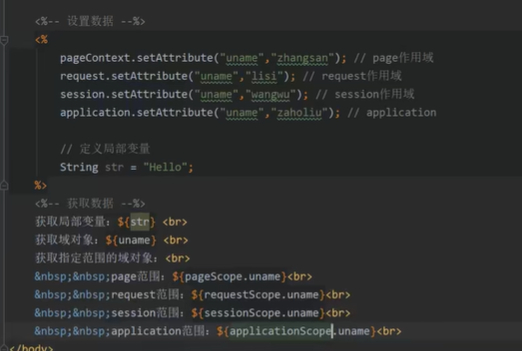

#### 2.4.1获取数据：

获取list

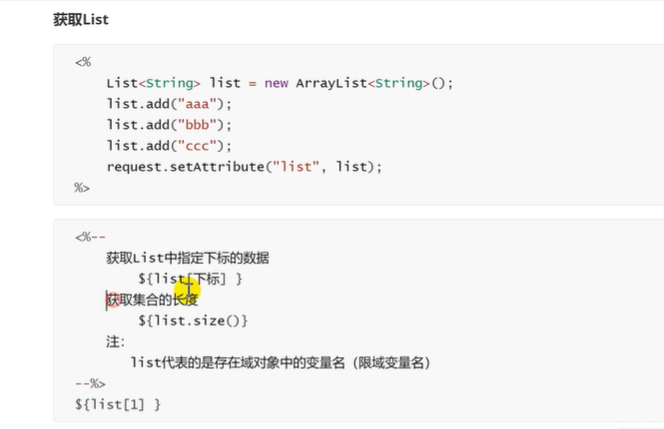

获取map

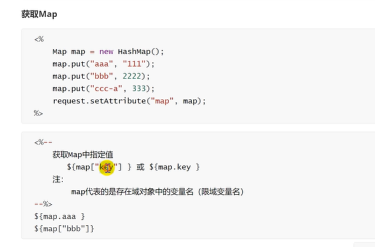

java对象

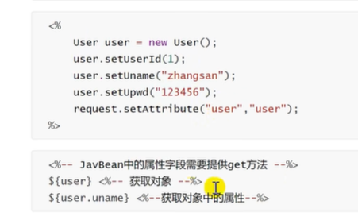

总结：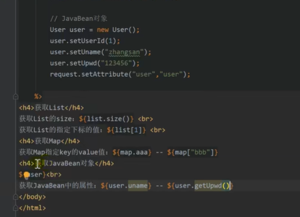

#### 2.4.2empty和el表达式运算

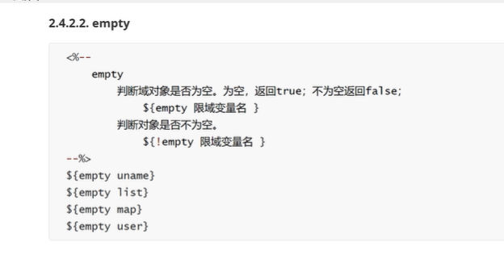

对象是字符串和list的情况，空的map为true，但是空的javabean属于false，因为分配了地址

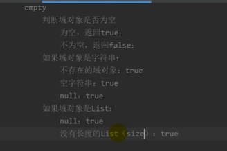

### 3.JSTL

核心库Core简称c

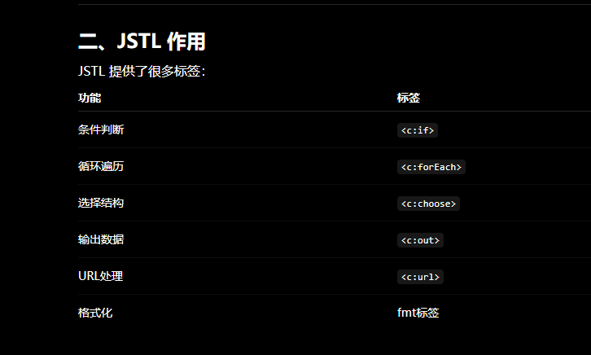

#### 3.2条件动作标签

if标签

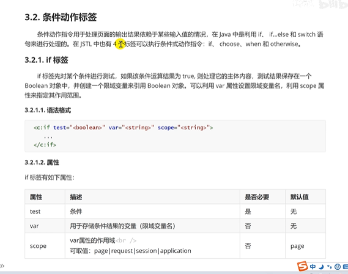

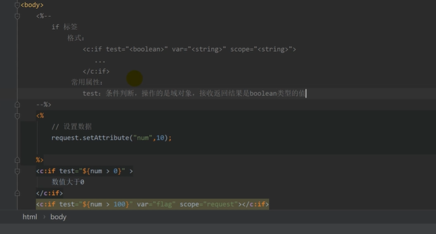

choose，when和otherwise标签，多分支判断

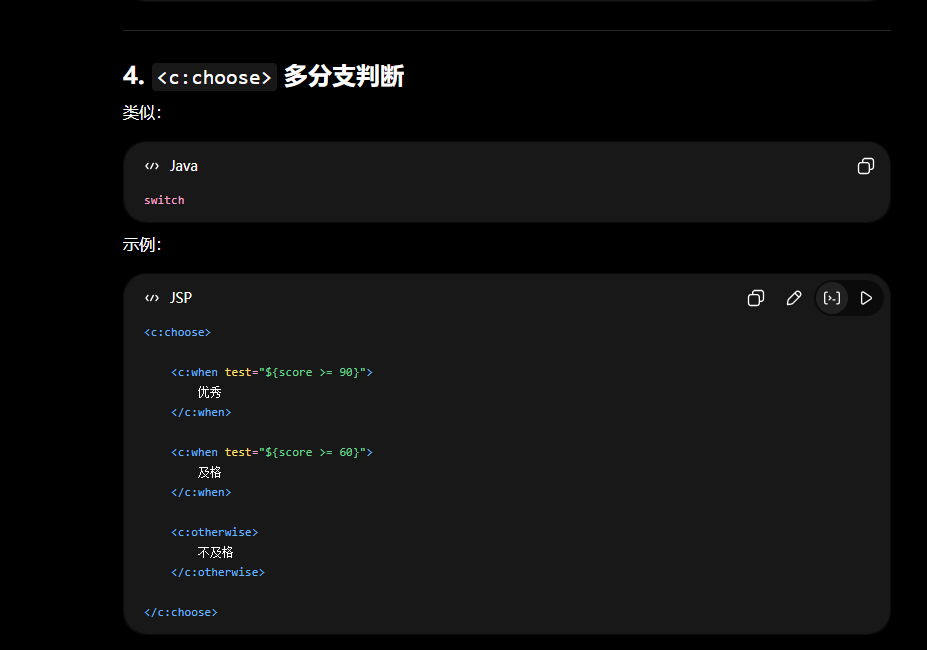

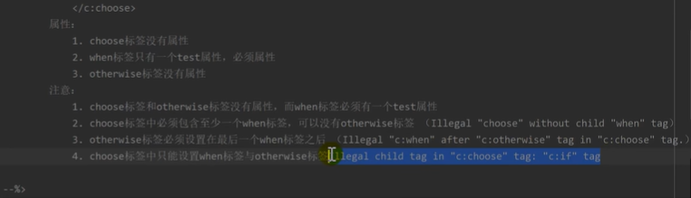

#### 3.3foreach标签

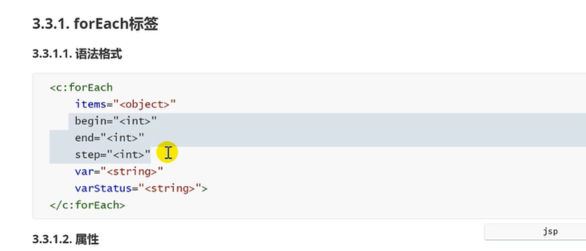

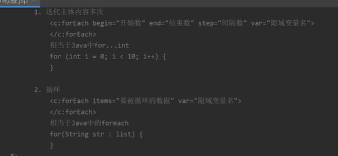

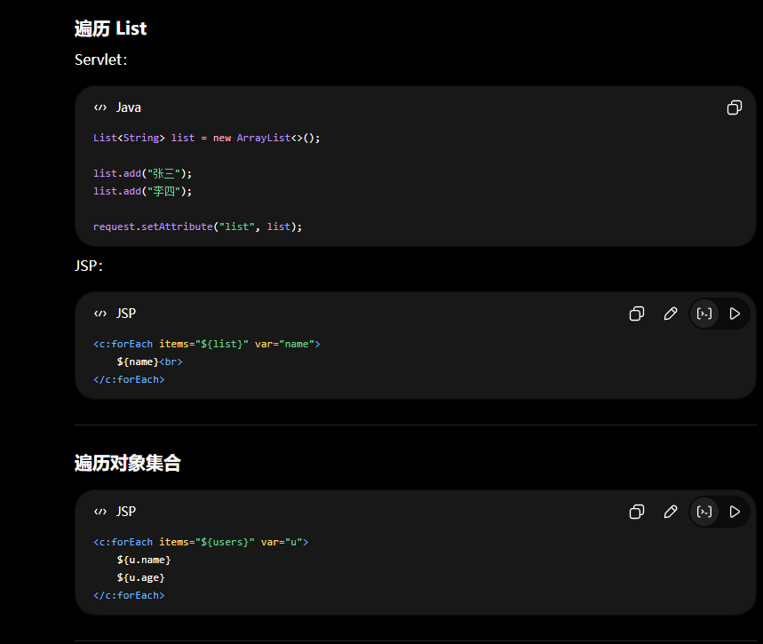

循环表格：

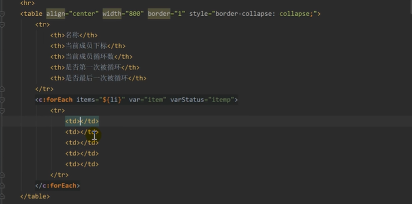

循环对象：

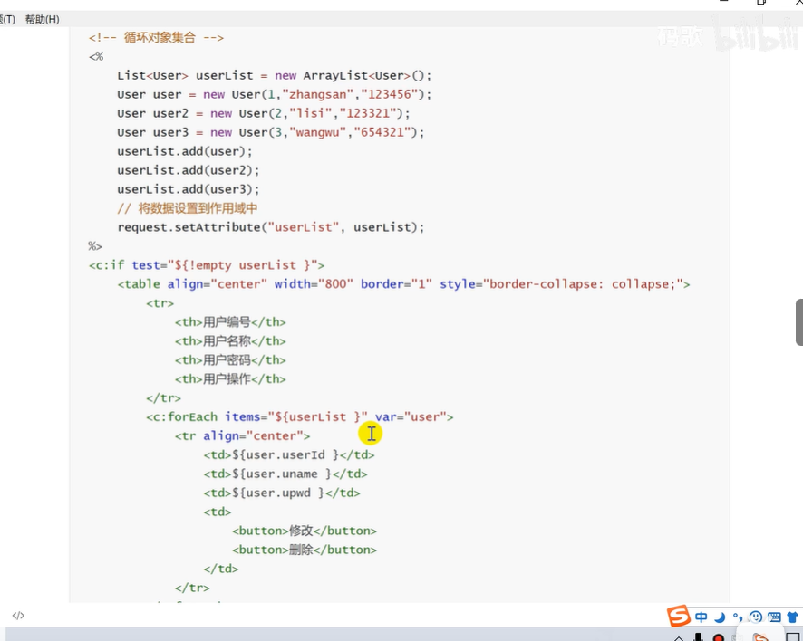

循环map：

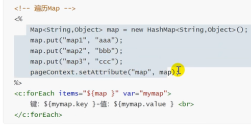

#### 3.4格式化标签（fmt库）

##### 3.4.1格式化日期

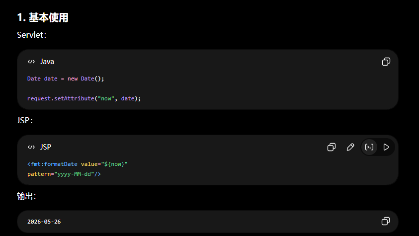

##### 3.4.2格式化数字

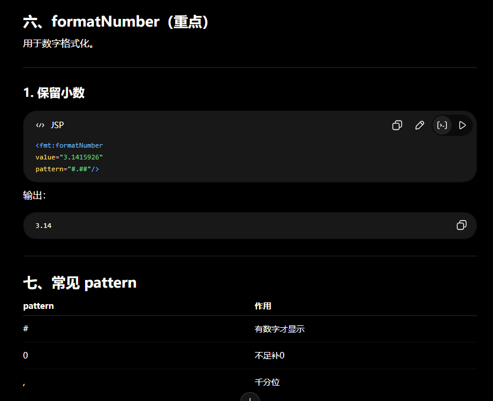

##### 3.4.3字符串转。。

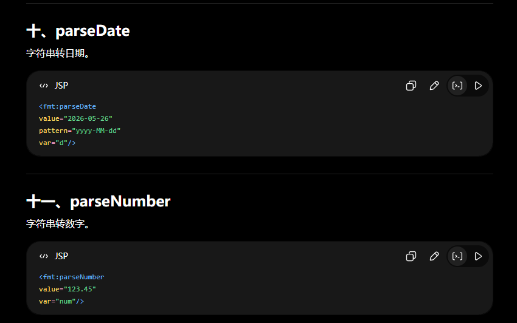

### 4.拦截器/拦截器

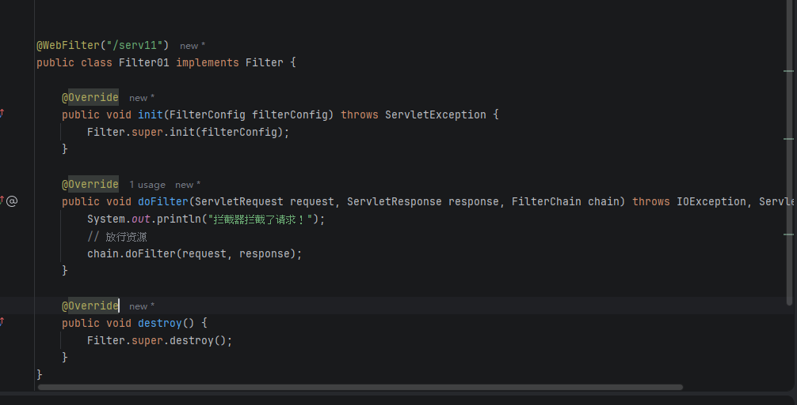

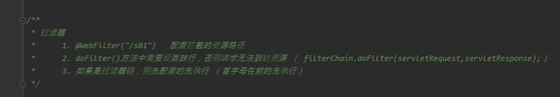

#### 4.1拦截器设置


```
// 打印URI
System.out.println("URL= " + req.getRequestURL());
System.out.println("URI= " + req.getRequestURI());
```

URL= http://localhost:8080/jsp/serv11
URI= /jsp/serv11


    package com.example.filter;
    
    import javax.servlet.*;
    import javax.servlet.http.HttpServletRequest;
    import javax.servlet.http.HttpServletResponse;
    import javax.servlet.http.HttpSession;
    import java.io.IOException;
    
    
    // 用注解替代 web.xml 的配置
    @WebFilter(filterName = "LoginFilter", urlPatterns = "/*")
    public class LoginFilter implements Filter {
        @Override
        public void init(FilterConfig filterConfig) throws ServletException {}
    
    	@Override
    	public void doFilter(ServletRequest request, ServletResponse response, FilterChain chain) 
            throws IOException, ServletException {
        
            HttpServletRequest req = (HttpServletRequest) request;
            HttpServletResponse resp = (HttpServletResponse) response;
            HttpSession session = req.getSession(false);
    
            // 1. 获取当前请求的 URI
            String requestURI = req.getRequestURI();
    
            // 2. 定义需要放行的页面和资源的关键字
            // 必须包含你的登录页面（例如 login.jsp）和提交登录请求的 Servlet/Action
            boolean isLoginPage = requestURI.contains("login.jsp") || requestURI.contains("loginServlet");
            // 可选：放行静态资源（css, js, images）
            boolean isStaticResource = requestURI.contains("/css/") || requestURI.contains("/js/") || requestURI.contains("/images/");
    
            // 3. 判断是否登录，或者是否是放行的页面
            boolean isLoggedIn = (session != null && session.getAttribute("user") != null);
    
            if (isLoggedIn || isLoginPage || isStaticResource) {
                // 如果已登录，或者是登录页面/静态资源，直接放行
                chain.doFilter(request, response);
            } else {
                // 否则，重定向到登录页面
                resp.sendRedirect(req.getContextPath() + "/login.jsp");
    	}
    }
    
    @Override
    public void destroy() {}
}

拦截和放行规则

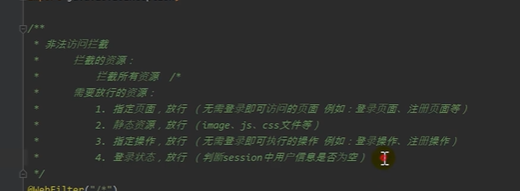

#### 4.2监听器

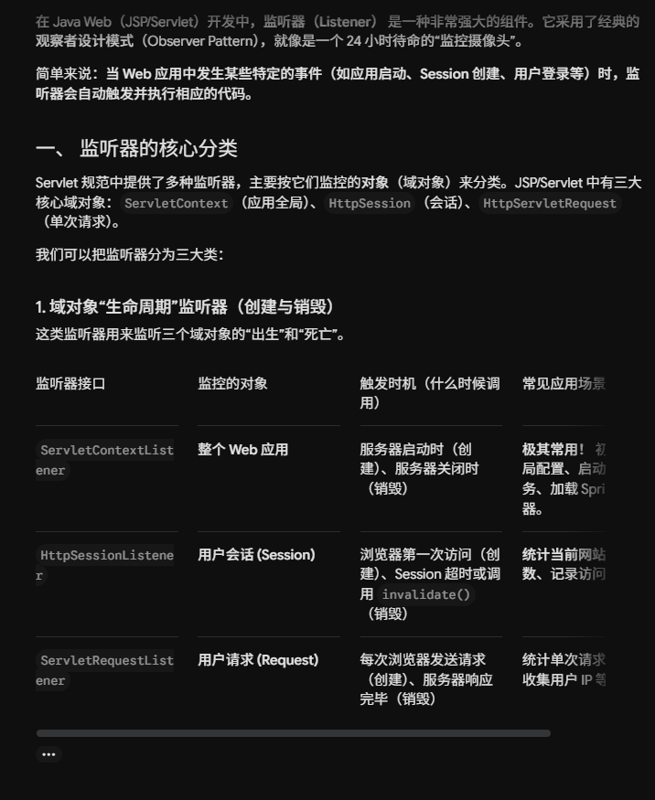

最常用的 `ServletContextListener`（应用启动/停止监听）为例：

```java

package com.example.listener;

import javax.servlet.ServletContextEvent;
import javax.servlet.ServletContextListener;
import javax.servlet.annotation.WebListener;

// 使用注解注册监听器，服务器会自动扫描
@WebListener
public class MyContextListener implements ServletContextListener {

// 当 Web 应用【启动完毕】时，Tomcat 会自动调用这个方法
@Override
public void contextInitialized(ServletContextEvent sce) {
    System.out.println("🚀 [系统提示] Web应用已成功启动，正在初始化全局数据...");
    // 示例：可以在这里把数据库连接池、全局配置放到 ServletContext 中
    sce.getServletContext().setAttribute("globalTitle", "我的极简商城");
}

// 当 Web 应用【准备停止/卸载】时，Tomcat 会自动调用这个方法
@Override
public void contextDestroyed(ServletContextEvent sce) {
    System.out.println("🛑 [系统提示] Web应用正在关闭，正在清理资源（如关闭数据库连接、停止定时任务）...");
}
```
}
